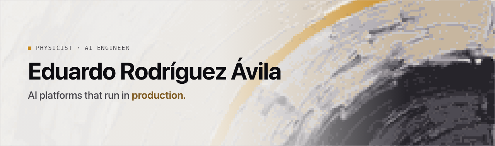
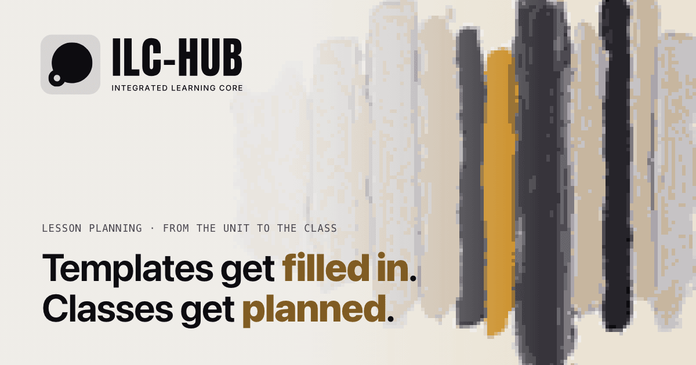

## About

- I build AI platforms and run them in production. I founded **[ILC-HUB](https://ilc-hub.com)**, which generates lesson plans, assessable activities and exams for schools.
- I work with LLMs, RAG and code agents, and I check the results with metrics that fit the problem.
- I come from physics: I model the problem first, then build and operate.

## Featured project

**Audhdel 3** is ILC-HUB's product: lesson-sequence planners for school coordinators, from the unit to the class, running in production. Planning a subject went from two or three weeks to 30–40 minutes (my estimate, from years as a teacher).

**[Case study](https://eravila.dev/en/projects/ilc)** · [ILC-HUB](https://ilc-hub.com)

Also: **[fraud-detection](https://github.com/EduardoRdgzA/fraud-detection)**, real-time fraud scoring on 1M bank transactions (XGBoost, FastAPI, Astro, one Docker container). [Live demo](https://fraud-detection.eravila.dev)

## Stack

