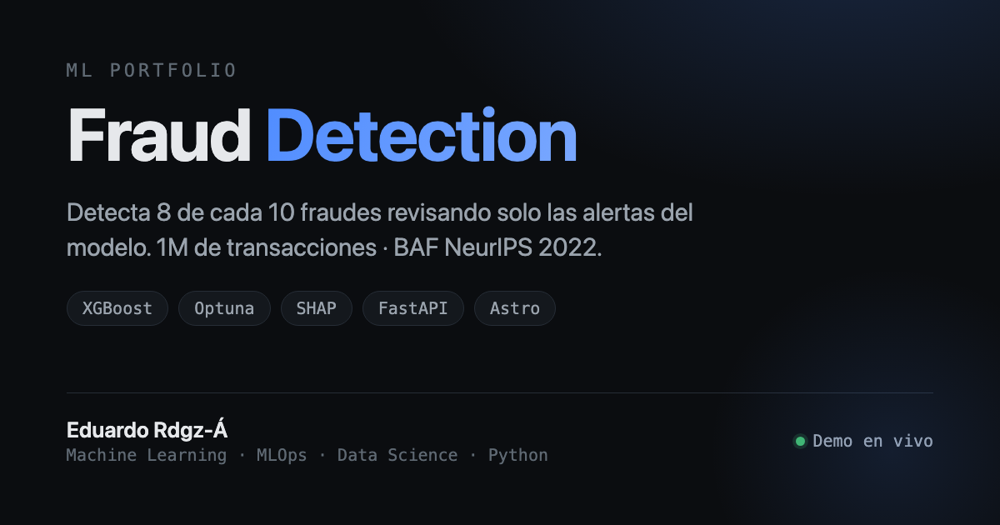
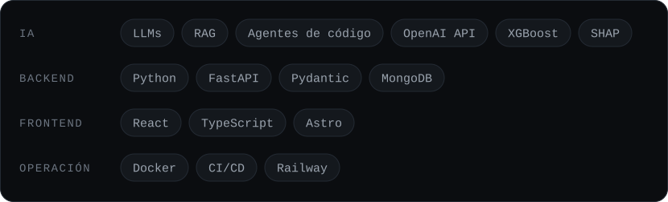

## Qué hago

- Construyo y opero **[ILC-HUB](https://ilc-hub.com)**, una plataforma de IA que genera planeaciones, actividades evaluables y exámenes para escuelas. Planear una materia pasó de dos o tres semanas a 30 o 40 minutos (estimado con mi experiencia como docente).
- Trabajo con LLMs, RAG y agentes de código, y reviso los resultados con métricas que corresponden al problema.
- Vengo de la física: primero modelo el problema, después construyo y opero.

## Proyecto destacado

Puntuación de fraude en tiempo real sobre 1M de transacciones bancarias (BAF NeurIPS 2022): XGBoost entrenado y servido con FastAPI, frontend en Astro y un solo contenedor Docker en Railway.

**[Demo en vivo](https://fraud-detection.eravila.dev)** · [Código](https://github.com/EduardoRdgzA/fraud-detection)

## Stack

